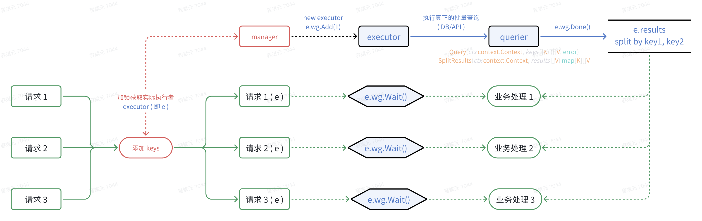

# 使用文档
## 概述

- 一个基于 Go 语言的项目，旨在将多个独立的查询整合为一个统一的查询，从而实现标准化的下游系统集成——例如，通过用户 ID 获取用户信息。
- A Go-based project designed to consolidate multiple discrete queries into a single unified query, thereby enabling standardized downstream system integration—for instance, retrieving user information via a user ID.

## 功能特性

- **自动批处理**：将多个独立的查询合并为批量操作
- **双重触发机制**：通过大小或超时触发批量查询
- **线程安全**：支持多个 goroutine 并发使用
- **简洁 API**：提供清晰的 `Get()` 和 `GetByKeys()` 方法
- **灵活配置**：可调整批处理大小、等待时间和超时时间
- **类型安全**：支持泛型类型参数
- **错误处理**：完整的错误传播和上下文支持

## 快速开始

### 安装

```go
import "dev.aminer.cn/rongbinyuan/zkit/zbatch/v1/zbatch"
```

### 基本用法

#### 1. 实现查询接口

首先，实现 `BatchQueryI` 接口：

```go
type UserQuery struct {
    db *sql.DB
}

// Query 执行批量查询并返回所有结果
func (q *UserQuery) Query(ctx context.Context, keys []int) ([]User, error) {
    // 执行批量查询（例如：SELECT WHERE id IN (...)）
    rows, err := q.db.QueryContext(ctx, 
        "SELECT id, name, age FROM users WHERE id IN (?)", 
        sqlx.In(keys))
    if err != nil {
        return nil, err
    }
    defer rows.Close()
    
    var users []User
    for rows.Next() {
        var user User
        if err := rows.Scan(&user.ID, &user.Name, &user.Age); err != nil {
            return nil, err
        }
        users = append(users, user)
    }
    return users, nil
}

// SplitResults 将结果映射回原始的 keys
func (q *UserQuery) SplitResults(ctx context.Context, results []User) map[int][]User {
    result := make(map[int][]User, len(results))
    for _, user := range results {
        result[user.ID] = []User{user}
    }
    return result
}
```

#### 2. 创建批量查询管理器

```go
import (
    "context"
    "time"
    "dev.aminer.cn/rongbinyuan/zkit/zbatch/v1/zbatch"
)

func main() {
    ctx := context.Background()
    
    // 配置批量查询设置
    config := zbatch.BatchQueryerConfig{
        MaxBatchSize:  100,               // 每批最大 key 数
        MaxWaitTime:   100 * time.Millisecond, // 触发前最大等待时间
        MaxCtxTimeOut: 5 * time.Second,       // 每批最大超时时间
    }
    
    // 创建查询管理器
    query := &UserQuery{db: yourDB}
    manager := zbatch.NewBatchQueryManager(ctx, config, query)
    
    // 使用管理器...
}
```

#### 3. 查询单个值（Get）

```go
// 查询单个用户
users, exists, err := manager.Get(ctx, 123)
if err != nil {
    log.Fatal(err)
}
if !exists {
    fmt.Println("用户未找到")
    return
}
fmt.Printf("用户: %+v\n", users)
```

#### 4. 查询多个值（GetByKeys）

```go
// 在一个请求中查询多个用户
userIDs := []int{1, 2, 3, 4, 5}
results, err := manager.GetByKeys(ctx, userIDs)
if err != nil {
    log.Fatal(err)
}

// 处理结果
for userID, users := range results {
    if len(users) > 0 {
        fmt.Printf("用户 %d: %+v\n", userID, users[0])
    }
}
```

### 并发使用

管理器完全线程安全，设计用于并发使用：

```go
// 多个 goroutine 可以安全地使用同一个管理器
var wg sync.WaitGroup
for i := 0; i < 100; i++ {
    wg.Add(1)
    go func(id int) {
        defer wg.Done()
        
        users, exists, err := manager.Get(ctx, id)
        if err != nil {
            fmt.Printf("错误: %v\n", err)
            return
        }
        if exists {
            fmt.Printf("用户 %d: %+v\n", id, users[0])
        }
    }(i)
}
wg.Wait()
```

## 配置指南

### BatchQueryerConfig

| 参数 | 类型 | 默认值 | 描述 | 推荐范围                    |
|------|------|--------|------|-------------------------|
| MaxBatchSize | int | 100 | 触发查询前的每批最大 key 数 | 10-1000                 |
| MaxWaitTime | time.Duration | 1000ms | 触发查询前的最大等待时间 | 50ms-5s                 |
| MaxCtxTimeOut | time.Duration | 3000ms | 每批查询的最大超时时间 | 1s-10s (大于 MaxWaitTime) |

## 工作原理

### 批处理逻辑

model.png

## API 参考

### NewBatchQueryManager

```go
func NewBatchQueryManager[K comparable, V any](
    ctx context.Context,
    config BatchQueryerConfig,
    queryer BatchQueryI[K, V],
) *BatchQueryManager[K, V]
```

创建一个新的批量查询管理器。

**参数**:
- `ctx`: 所有操作的父上下文
- `config`: 批处理配置设置
- `queryer`: BatchQueryI 接口的实现

**返回**: BatchQueryManager 的指针

### Get

```go
func (m *BatchQueryManager[K, V]) Get(
    ctx context.Context,
    key K,
) ([]V, bool, error)
```

查询单个 key。

**参数**:
- `ctx`: 此次查询的上下文
- `key`: 要查询的 key

**返回**:
- `[]V`: 此 key 对应的值切片
- `bool`: 如果 key 存在于结果中则为 true
- `error`: 查询失败时的错误

### GetByKeys

```go
func (m *BatchQueryManager[K, V]) GetByKeys(
    ctx context.Context,
    keys []K,
) (map[K][]V, error)
```

在一次请求中查询多个 key。

**参数**:
- `ctx`: 此次查询的上下文
- `keys`: 要查询的 key 切片

**返回**:
- `map[K][]V`: key 到其值的映射
- `error`: 查询失败时的错误

## 最佳实践

### 1. 重用管理器实例

```go
// ✅ 好的做法：创建一个管理器，重用它
manager := zbatch.NewBatchQueryManager(ctx, config, query)
defer func() {
    for i := 0; i < 10000; i++ {
        manager.Get(ctx, i)
    }
}()

// ❌ 不好的做法：为每次查询创建管理器
for i := 0; i < 10000; i++ {
    m := zbatch.NewBatchQueryManager(ctx, config, query)
    m.Get(ctx, i)
}
```

### 2. 需要多个值时使用 GetByKeys

```go
// ✅ 好的做法：一次性查询所有需要的 key
keys := []int{1, 2, 3, 4, 5}
results, err := manager.GetByKeys(ctx, keys)

// ❌ 不好的做法：分别查询每个 key
for _, id := range []int{1, 2, 3, 4, 5} {
    manager.Get(ctx, id)
}
```

### 3. 正确处理上下文

```go
// ✅ 好的做法：不使用上下文或从不取消
ctx, cancel := context.WithTimeout(context.Background(), 5*time.Second)
defer cancel()
results, err := manager.Get(ctx, 123)

// ❌  弊端：对于已初始化的 manager, 执行 manager.Get 方法时, 传入的 ctx 只会在 executor 添加查询 keys 时检测一次, 添加完成后便不受当前 ctx 控制 (避免单次查询的 ctx 取消, 导致该合并查询失败) 
results, err := manager.Get(context.Background(), 123)
```

### 4. 检查返回值

```go
// 始终检查所有返回值
values, exists, err := manager.Get(ctx, key)
if err != nil {
    // 处理错误
    return err
}
if !exists {
    // 处理未找到
    return nil
}
// 处理值
```

## 性能优化建议

### 减少查询次数

- 需要多个值时使用 `GetByKeys`
- 更大的 `MaxBatchSize` = 更少的实际查询
- 调整 `MaxWaitTime` 来平衡延迟和吞吐量


## 示例

参见 `example/main.go` 获取完整的工作示例，包括：
- 基本的 `Get()` 使用
- 基本的 `GetByKeys()` 使用
- 高并发场景

## 贡献

欢迎贡献！请参阅 CONTRIBUTING.md 了解指南。
